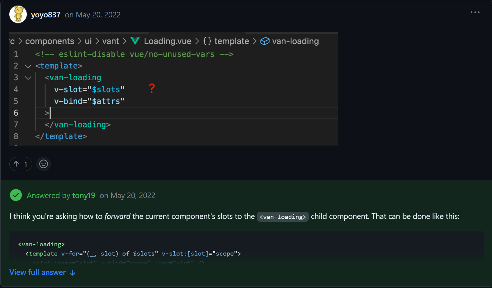
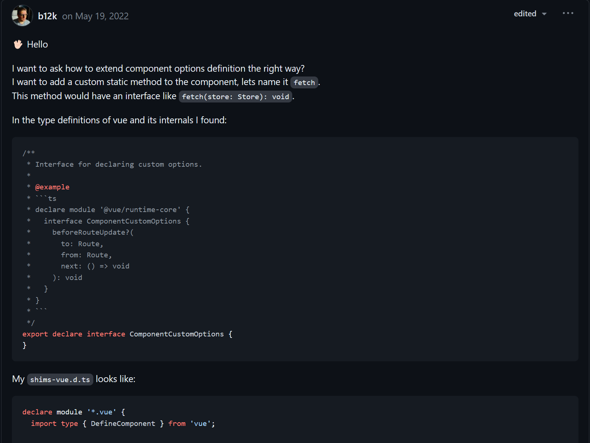
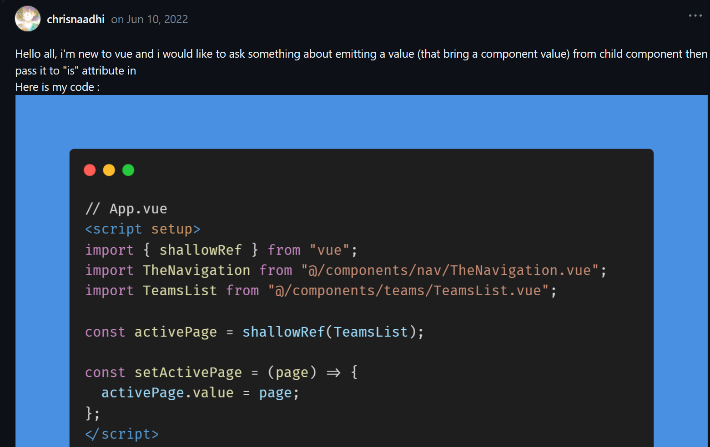
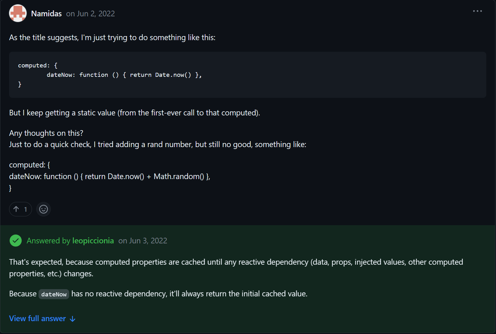

# Vue-Discussion-Hub

## If you have any questions about Vue3 to discuss,you can find in the follow,if you can't find it, you can discuss in the [Vue Discussions](https://github.com/vuejs/core/discussions)

---

### 1. How import a component defined by setup?

### [Discussion](https://github.com/vuejs/core/discussions/5934)

###  2. How apply all slot to children?

### [Discussion](https://github.com/vuejs/core/discussions/5962)

###  3. How to extend component options type definition?

### [Discussion](https://github.com/vuejs/core/discussions/5951)

###  4. Global component doesn't work with emit value passing via child component ?

### [Discussion](https://github.com/vuejs/core/discussions/6091)

###  5. Simple Date.now() computed not working properly

### [Discussion](https://github.com/vuejs/core/discussions/6051)

## TODO
