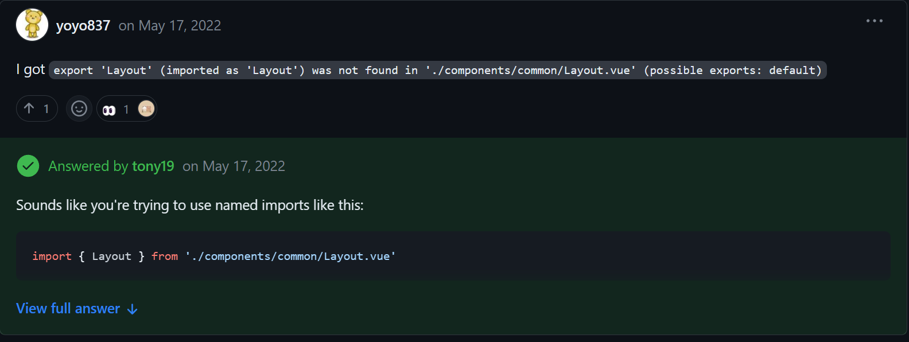
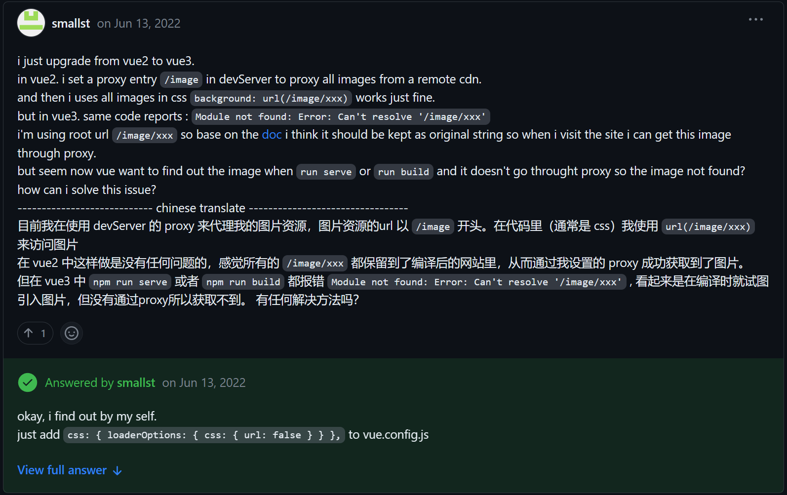
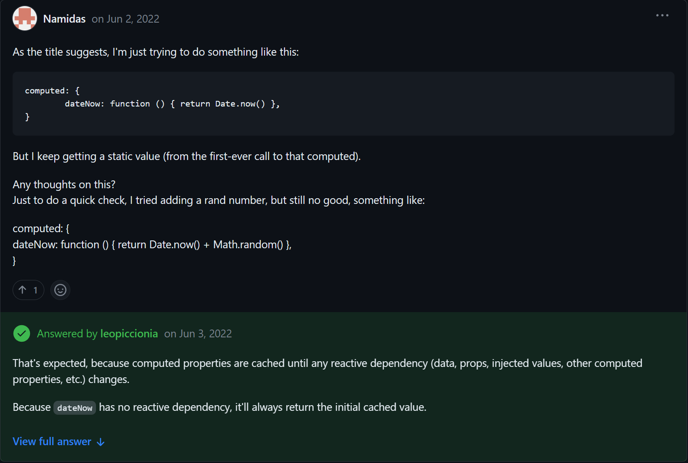
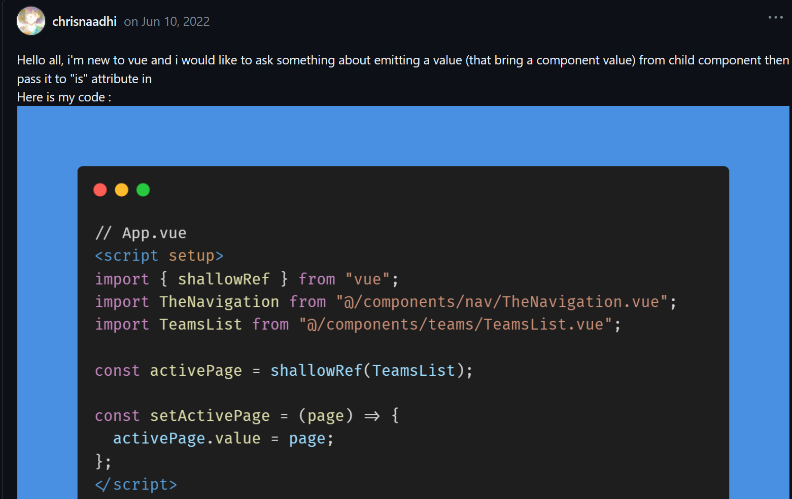
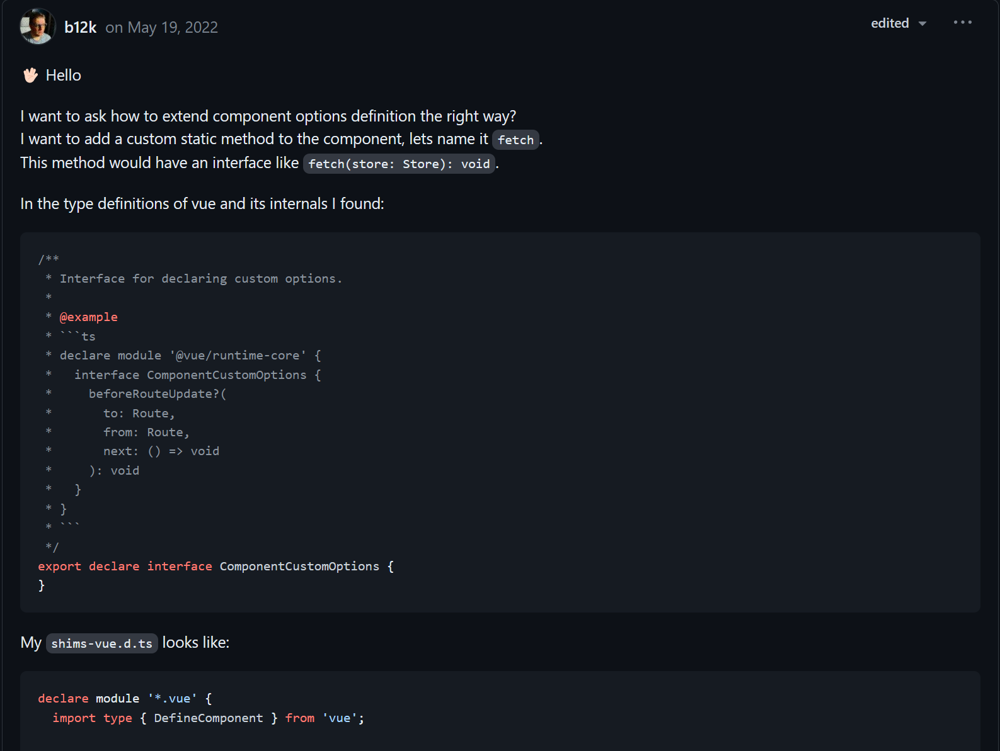
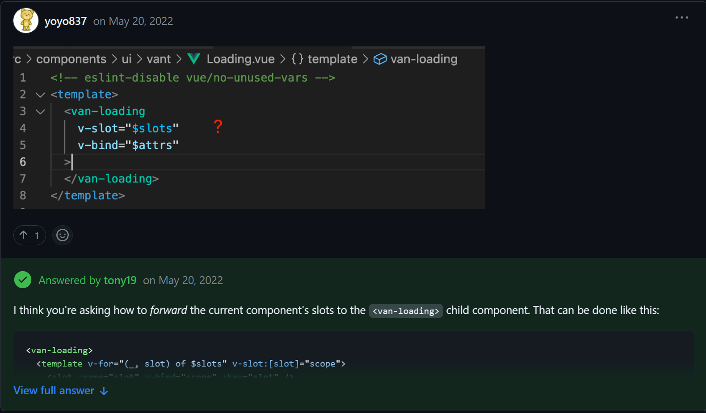

# Vue-Discussion-Hub

## If you have any questions about Vue3 to discuss,you can find in the follow,if you can't find it, you can discuss in the [Vue Discussions](https://github.com/vuejs/core/discussions)

---
###  `0. How import a component defined by setup?`

    
### [Discussion](https://github.com/vuejs/core/discussions/5934)

###  `1. 请教一个关于数据转换的问题`

    
### [Discussion](https://github.com/vuejs/core/discussions/6662)

###  `2. Custom Element don't receive props when using SFC`

    
### [Discussion](https://github.com/vuejs/core/discussions/6619)

###  `3. 多个相同子组件的情况下，如何在子组件中知道自己的index或key`

    
### [Discussion](https://github.com/vuejs/core/discussions/6488)

###  `4. Why does this component emit event in Vue3 ??`

    
### [Discussion](https://github.com/vuejs/core/discussions/6585)

###  `5. Conflicts of custom elements' named slot (defineCustomElement)`

    
### [Discussion](https://github.com/vuejs/core/discussions/6574)

###  `6. use watch in for {} will destory when the component unmount?`

    
### [Discussion](https://github.com/vuejs/core/discussions/6583)

###  `7. Is it possible to add directive to all matching elements automatically?`

    
### [Discussion](https://github.com/vuejs/core/discussions/6579)

###  `8. How can i know if Parent component pass a function to Child component`

    
### [Discussion](https://github.com/vuejs/core/discussions/6481)

###  `9. v-if rerender input bug in production, works fine in dev`

    
### [Discussion](https://github.com/vuejs/core/discussions/6452)

###  `10. file input @change do not trigger function again`

    
### [Discussion](https://github.com/vuejs/core/discussions/6440)

###  `11. Not able to recursive pass scopedSlots in recursive component.`

    
### [Discussion](https://github.com/vuejs/core/discussions/6445)

###  `12. Why "before" and "after" attributes are discarded?`

    
### [Discussion](https://github.com/vuejs/core/discussions/6408)

###  `13. I need help, they say v-html is not safe, but how would I render posts from database?`

    
### [Discussion](https://github.com/vuejs/core/discussions/6386)

###  `14. Problems using v-bind in CSS`

    
### [Discussion](https://github.com/vuejs/core/discussions/6353)

###  `15. why inject() must be called synchronously ?`

    
### [Discussion](https://github.com/vuejs/core/discussions/6276)

###  `16. 在script setup中，子组件怎么抛出一个ref给父组件调用自己的子组件的方法？`

    
### [Discussion](https://github.com/vuejs/core/discussions/6251)

###  `17. vue3 how to get components uid`

    
### [Discussion](https://github.com/vuejs/core/discussions/6217)

###  `18. A weird typescript problem, anyone help?`

    
### [Discussion](https://github.com/vuejs/core/discussions/6145)

###  `19. Strange behavior with watch and watchEffect`

    
### [Discussion](https://github.com/vuejs/core/discussions/6176)

###  `20. How to get the EmitsType of components in TypeScript ?`

    
### [Discussion](https://github.com/vuejs/core/discussions/6116)

###  `21. how to use proxyed assets in css url ?`

    
### [Discussion](https://github.com/vuejs/core/discussions/6104)

###  `22. Simple Date.now() computed not working properly`

    
### [Discussion](https://github.com/vuejs/core/discussions/6051)

###  `23. Global component doesn't work with emit value passing via child component ?`

    
### [Discussion](https://github.com/vuejs/core/discussions/6091)

###  `24. How to extend component options type definition?`

    
### [Discussion](https://github.com/vuejs/core/discussions/5951)

###  `25. How apply all slot to children?`

    
### [Discussion](https://github.com/vuejs/core/discussions/5962)

###  `26. The child component reported an error when a parent-child parameter was passed in the request Cannot read properties of undefined`

    
### [Discussion](https://github.com/vuejs/core/discussions/7146)

###  `27. 在Vue3 + Vite项目，将vnode渲染到dom上，开发环境和生产环境表现不一致？`

    
### [Discussion](https://github.com/vuejs/core/discussions/6627)

###  `28. v-model not updating from external changes? Is this a bug?`

    
### [Discussion](https://github.com/vuejs/core/discussions/7120)

###  `29. vue3 引入富文本组件vueup/vue-quill，本地运行没问题，部署到线上报错：TypeError: Cannot read properties of null (reading 'refs')`

    
### [Discussion](https://github.com/vuejs/core/discussions/7100)

###  `30. Advise on creating a Vue 2 / Vue 3 compatible component library`

    
### [Discussion](https://github.com/vuejs/core/discussions/7055)

###  `31. How to pass attrs to built-in component by the slot?`

    
### [Discussion](https://github.com/vuejs/core/discussions/7053)

###  `32. vue教程里的暴露是什么意思？`

    
### [Discussion](https://github.com/vuejs/core/discussions/7029)

###  `33. What is the best way to structure a component with the new Vue 3 script setup?`

    
### [Discussion](https://github.com/vuejs/core/discussions/6911)

###  `34. how to pass down all things(props, slots, listeners ...) to child component ? 怎样把所有的props、slots、listeners 传给子组件？`

    
### [Discussion](https://github.com/vuejs/core/discussions/7001)

###  `35. Variable behavior`

    
### [Discussion](https://github.com/vuejs/core/discussions/6866)

###  `36. can component with "is" change it's value?`

    
### [Discussion](https://github.com/vuejs/core/discussions/6981)

###  `37. Err missing module postcss-url && null(setting 'peer')`

    
### [Discussion](https://github.com/vuejs/core/discussions/6942)

###  `38. Exporting nodeOps and patchProp from runtime-dom package`

    
### [Discussion](https://github.com/vuejs/core/discussions/6907)

###  `39. :deep()无法穿透element子元素`

    
### [Discussion](https://github.com/vuejs/core/discussions/6871)

###  `40. Is there a way to break/return from Vue3 <script setup>?`

    
### [Discussion](https://github.com/vuejs/core/discussions/6862)

###  `41. 如何减少重复代码，以面向对象方式开发？`

    
### [Discussion](https://github.com/vuejs/core/discussions/6837)

###  `42. How to programmatically register components in script setup?`

    
### [Discussion](https://github.com/vuejs/core/discussions/6780)

###  `43. How to forward all child component methods to parent component?`

    
### [Discussion](https://github.com/vuejs/core/discussions/6753)

###  `44. When I build the project and open it with Live Server.The browser console output the error of Cannot read properties of undefined (reading 'defineComponent')`

    
### [Discussion](https://github.com/vuejs/core/discussions/6750)

###  `45. Selected attribute being removed from <option> in <select> element`

    
### [Discussion](https://github.com/vuejs/core/discussions/6701)

###  `46. different behavior in development vs production build`

    
### [Discussion](https://github.com/vuejs/core/discussions/6717)

###  `47. how can I expose all events of child input?`

    
### [Discussion](https://github.com/vuejs/core/discussions/6719)

###  `48. Why Slot props undefined when wrapped around v-if ?`

    
### [Discussion](https://github.com/vuejs/core/discussions/6694)

###  `49. 
 tag @toggle triggers when :open changes`

    
### [Discussion](https://github.com/vuejs/core/discussions/6696)

###  `50. Html页面元素的ref属性，怎么设置成某个对象的属性？`

    
### [Discussion](https://github.com/vuejs/core/discussions/6679)

###  `51. Use inject/provide in functionnal components`

    
### [Discussion](https://github.com/vuejs/core/discussions/7521)

###  `52. why does the function excute twice in child component?`

    
### [Discussion](https://github.com/vuejs/core/discussions/7527)

###  `53. Why doesn't :deep work in <style module>?`

    
### [Discussion](https://github.com/vuejs/core/discussions/7524)

###  `54. Unable to use ref on component!`

    
### [Discussion](https://github.com/vuejs/core/discussions/7508)

###  `55. 在什么场景下组件用 h 函数 或者 jsx #3931`

    
### [Discussion](https://github.com/vuejs/core/discussions/6945)

###  `56. Is it possible to convert an import component to html in a .vue file?`

    
### [Discussion](https://github.com/vuejs/core/discussions/7454)

###  `57. Should I use shallowRef instead of ref in template references?`

    
### [Discussion](https://github.com/vuejs/core/discussions/7452)

###  `58. why table elements are nonStringifiable?`

    
### [Discussion](https://github.com/vuejs/core/discussions/7407)

###  `59. How to use <suspense></suspense> with <components :is=xxx> ?`

    
### [Discussion](https://github.com/vuejs/core/discussions/7411)

###  `60. How to change property value only when transition completed?`

    
### [Discussion](https://github.com/vuejs/core/discussions/7415)

###  `61. 在globalProperties上挂载的响应式属性，在template中必须使用.value获取`

    
### [Discussion](https://github.com/vuejs/core/discussions/7405)

###  `62. A component is mounted using render(), and when the parent component's value changes, the child component does not change.`

    
### [Discussion](https://github.com/vuejs/core/discussions/7396)

###  `63. Problem with understanding of documentation regarding reactive object and watchEffect (featuring playground)`

    
### [Discussion](https://github.com/vuejs/core/discussions/7375)

###  `64. refs are not automatically unwrapping in templates.`

    
### [Discussion](https://github.com/vuejs/core/discussions/7386)

###  `65. Error on Suspense + render function + prop change while awaiting for render`

    
### [Discussion](https://github.com/vuejs/core/discussions/7202)

###  `66. Property 'cause' does not exist on type 'Error'`

    
### [Discussion](https://github.com/vuejs/core/discussions/7263)

###  `67. watching route doesn't fire with composition api`

    
### [Discussion](https://github.com/vuejs/core/discussions/7239)

###  `68. Vue3 + typescript (vue-cli-service): How to create Vue NPM library?`

    
### [Discussion](https://github.com/vuejs/core/discussions/7222)

###  `69. How to get ref of an element behind v-if`

    
### [Discussion](https://github.com/vuejs/core/discussions/6127)

###  `70. Test failed in Windows`

    
### [Discussion](https://github.com/vuejs/core/discussions/7209)

###  `71. When does vue need to set the dry parameter when running the release`

    
### [Discussion](https://github.com/vuejs/core/discussions/7191)

###  `72. Are watchers declared in methods and onMouned auto destroyed?`

    
### [Discussion](https://github.com/vuejs/core/discussions/7189)

###  `73. 请问有谁知道vue官网有关文档使用工具生成的还是每个都是单独写的？`

    
### [Discussion](https://github.com/vuejs/core/discussions/7183)

###  `74. type error when I custom css to my button`

    
### [Discussion](https://github.com/vuejs/core/discussions/7182)

###  `75. 对UI库（element Plus）的组件进行二次封装时，v-model 与 透传 出现的问题`

    
### [Discussion](https://github.com/vuejs/core/discussions/7159)

###  `76. computed property inside reactive typescript error`

    
### [Discussion](https://github.com/vuejs/core/discussions/7791)

###  `77. this different behavior about app mount to target container on vue2 and vue3`

    
### [Discussion](https://github.com/vuejs/core/discussions/7772)

###  `78. Why onTrigger watcher options only work in development mode?`

    
### [Discussion](https://github.com/vuejs/core/discussions/7739)

###  `79. Using useCssModule return value in <style module>`

    
### [Discussion](https://github.com/vuejs/core/discussions/7732)

###  `80. Error involving changing rendered list of items (Unhandled error during execution of scheduler flush)`

    
### [Discussion](https://github.com/vuejs/core/discussions/7740)

###  `81. 求教：非构建创建组件时，如何使用 ID 选择器来指向一个元素，使用其内容作为模板来源？`

    
### [Discussion](https://github.com/vuejs/core/discussions/7705)

###  `82. I need help, yarn dev works really fine but yarn build has so many errors`

    
### [Discussion](https://github.com/vuejs/core/discussions/7701)

###  `83. setup语法糖的组件import后没有类型提示`

    
### [Discussion](https://github.com/vuejs/core/discussions/6377)

###  `84. How to set a props type with InputHTMLAttributes?`

    
### [Discussion](https://github.com/vuejs/core/discussions/7546)

###  `85. "[Vue warn]: Missing required prop" but default value is defined`

    
### [Discussion](https://github.com/vuejs/core/discussions/7651)

###  `86. how use toRef with Map?`

    
### [Discussion](https://github.com/vuejs/core/discussions/7647)

###  `87. Can't use props in event binding`

    
### [Discussion](https://github.com/vuejs/core/discussions/7636)

###  `88. 同一个项目多个vue3.x版本共存时，是否会出现问题？`

    
### [Discussion](https://github.com/vuejs/core/discussions/7621)

###  `89. Failed to resolve component: Sku`

    
### [Discussion](https://github.com/vuejs/core/discussions/7596)

###  `90. How can i use Spread syntax with script setup`

    
### [Discussion](https://github.com/vuejs/core/discussions/7592)

###  `91. Is there any existing collections of composables for developer usage?`

    
### [Discussion](https://github.com/vuejs/core/discussions/7591)

###  `92. @keydown 按键事件问题`

    
### [Discussion](https://github.com/vuejs/core/discussions/7577)

###  `93. How can I use $emit correctly?`

    
### [Discussion](https://github.com/vuejs/core/discussions/7571)

###  `94. Select tag shows nothing selected when v-model variable has a value`

    
### [Discussion](https://github.com/vuejs/core/discussions/7565)

###  `95. Component error with types from *.d.ts files.`

    
### [Discussion](https://github.com/vuejs/core/discussions/7483)

###  `96. how to define the return value type of app.mount()`

    
### [Discussion](https://github.com/vuejs/core/discussions/7493)

###  `97. Trying to call two functions with @click`

    
### [Discussion](https://github.com/vuejs/core/discussions/7504)

###  `98. How to access unique component ID`

    
### [Discussion](https://github.com/vuejs/core/discussions/7549)

###  `99. Unhandled error during execution of scheduler flush`

    
### [Discussion](https://github.com/vuejs/core/discussions/7539)

###  `100. Defining props inside composables`

    
### [Discussion](https://github.com/vuejs/core/discussions/7463)

###  `101. What could be reason the file upload feature of component isn't working?`

    
### [Discussion](https://github.com/vuejs/core/discussions/8192)

###  `102. Is there any property on components to determine whether they're nested inside KeepAlive?`

    
### [Discussion](https://github.com/vuejs/core/discussions/8162)

###  `103. Generic Components`

    
### [Discussion](https://github.com/vuejs/core/discussions/8165)

###  `104. 如何在普通js文件中获取vue3实例`

    
### [Discussion](https://github.com/vuejs/core/discussions/7945)

###  `105. 在自定义指令中，怎么覆盖添加在组件上的事件监听方法？`

    
### [Discussion](https://github.com/vuejs/core/discussions/8145)

###  `106. Strange typing for v-for`

    
### [Discussion](https://github.com/vuejs/core/discussions/8128)

###  `107. How to refresh the component`

    
### [Discussion](https://github.com/vuejs/core/discussions/8098)

###  `108. 请问在vue3中该如何在子组件中判断emit注册的方法父组件是否传入呢？`

    
### [Discussion](https://github.com/vuejs/core/discussions/8092)

###  `109. 无法双向绑定`

    
### [Discussion](https://github.com/vuejs/core/discussions/8081)

###  `110. Get width of slot from useSlot()`

    
### [Discussion](https://github.com/vuejs/core/discussions/6726)

###  `111. Vue3 vite build shows blank page - please help`

    
### [Discussion](https://github.com/vuejs/core/discussions/8064)

###  `112. 官方说明文档的描述有点很奇怪，是不是错了？（我理解不对？）`

    
### [Discussion](https://github.com/vuejs/core/discussions/8037)

###  `113. ❓ What is correct way to get parent`

    
### [Discussion](https://github.com/vuejs/core/discussions/7990)

###  `114. When would Vue 3's end of life be?`

    
### [Discussion](https://github.com/vuejs/core/discussions/7887)

###  `115. request in setup block`

    
### [Discussion](https://github.com/vuejs/core/discussions/7950)

###  `116. SSR+CSR 基于动态路由`

    
### [Discussion](https://github.com/vuejs/core/discussions/7885)

###  `117. Using v-model with @vue/compat and configureCompat in Composition API`

    
### [Discussion](https://github.com/vuejs/core/discussions/7862)

###  `118. An interesting question about setup syntax sugar(一个关于setup语法糖的有意思的问题)`

    
### [Discussion](https://github.com/vuejs/core/discussions/7845)

###  `119. Passing component name to createElement doesn't compile component`

    
### [Discussion](https://github.com/vuejs/core/discussions/7838)

###  `120. Find components to be resolved after navigation in beforeEach (ex-getMatchedComponents)`

    
### [Discussion](https://github.com/vuejs/core/discussions/7230)

###  `121. Is there a way to keep reactive object up to date with the original one?`

    
### [Discussion](https://github.com/vuejs/core/discussions/7811)

###  `122. Unclear watchEffect example in the docs`

    
### [Discussion](https://github.com/vuejs/core/discussions/7796)

###  `123. How can we get compiled template work without .value`

    
### [Discussion](https://github.com/vuejs/core/discussions/7758)

###  `124. How to use render function in <script setup>?`

    
### [Discussion](https://github.com/vuejs/core/discussions/6629)

###  `125. vue3中input的value和绑定的ref存在不同的问题`

    
### [Discussion](https://github.com/vuejs/core/discussions/7793)

## TODO 
UPDATE IMAGE & UPDATE LIST